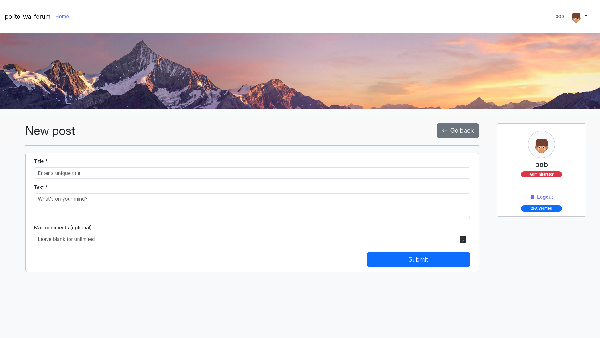

## React Client Application Routes

- Route `/`: Displays a list of all posts and offers a button to create a new post.
- Route `/posts/:id`: Displays the details of a specific post, including its content, comments, and a form to insert new comments. Features such as deletion of post and comments, marking as interesting and editing comments are offered here. `:id`: the unique identifier of the post (number).
- Route `/posts/new`: Contains the form for adding a post, allowing authenticated users to create and submit a new post.

## API Server

- GET `/api/posts`,
  - response body content:
    ```
    [
      {
        "id": number,
        "title": string,
        "text": string,
        "pub_timestamp": UNIX timestamp,
        "author": string,
        "related_comments_n": number,
        "max_comments": number | null
      }
    ]
    ```
- POST `/api/posts`,

  - request body content:
    ```
    {
      "title": string,
      "text": string,
      "max_comments": number (optional)
    }
    ```
  - response body content: `{"id": number}` (of the newly created post)

- GET `/api/posts/:id`,
  - request parameters: `id` (unique identifier of the post)
  - response body content:
    ```
    {
      "id": number,
      "title": string,
      "text": string,
      "pub_timestamp": UNIX timestamp,
      "author": string,
      "related_comments_n": number,
      "max_comments": number | null
    }
    ```
- DELETE `/api/posts/:id`,

  - request parameters: `id` (unique identifier of the post)
  - response body content: `{"ok": true}`

- GET `/api/posts/:id/comments-count`,
  - request parameters: `id` (unique identifier of the post)
  - response body content: `number` (of comments)
- GET `/api/posts/:id/comments`,
  - request parameters: `id` (unique identifier of the post)
  - response body content:
    ```
    {
      "onlyAnon": boolean,
      "data": [
        {
          "id": number,
          "post_id": number,
          "text": string,
          "author": string,
          "pub_timestamp": UNIX timestamp,
          "marked": boolean
        }
      ]
    }
    ```
- POST `/api/posts/:id/comments`,

  - request parameters: `id` (unique identifier of the post), request body content: `{"text": string}`
  - response body content: `{"id": number}` (of the newly created comment)

- PUT `/api/comments/:id`,

  - request parameters: `id` (unique identifier of the comment), request body content: `{"text": string}`
  - response body content: `{"ok": true}`

- DELETE `/api/comments/:id`,

  - request parameters: `id` (unique identifier of the comment)
  - response body content: `{"ok": true}`

- GET `/api/comments/:id/interesting-flags`,
  - request parameters: `id` (unique identifier of the comment)
  - response body content: `number` (of users who marked this comment as interesting)
- PUT `/api/comments/:id/interesting-flags`,

  - request parameters: `id` (unique identifier of the comment)
  - response body content: `{"ok": true}`

- DELETE `/api/comments/:id/interesting-flags`,

  - request parameters: `id` (unique identifier of the comment)
  - response body content: `{"ok": true}`

- GET `/auth/user`,
  - response body content:
    ```
    {
      "username": string,
      "email": string,
      "is_admin": boolean,
      "okTOTP": boolean
    }
    ```
- POST `/auth/login`,
  - request body content: `{"username": string (email), "password": string}`
  - response body content: `{"ok": true}`
- POST `/auth/totp`,
  - request body content: `{"code": string}`
  - response body content: `{"ok": true}`
- POST `/auth/logout`
  - response body content: `{"ok": true}`

## Database Tables

- Table `user` - Stores all users with login credentials (`email` and `password_hash` + user-unique `salt`), role of the user (`is_admin`), and optional `totp_secret`.
- Table `post` - Stores posts, defined by `title`, `text`, `author_id`, optional `max_comments` and `pub_timestamp`.
- Table `comment` - Stores comments posted by users (or anonymous users if `author_id` is NULL), each one linked to its post (via `post_id`), defined by `text`, `author_id` and `pub_timestamp`.
- Table `interesting_comment` - "Many-to-many" relationship between users and comments they marked as interesting (`user_id`, `comment_id`).

## Main React Components

- `useAuth` (`hooks/useAuth.jsx`): Custom hook that manages frontend user authentication state and user info.
- `usePosts` (`hooks/usePosts.jsx`): Custom hook that handles fetching all posts to be shown on the root page.
- `usePost` (`hooks/usePost.jsx`): Custom hook that handles fetching a specific post.
- `useComments` (`hooks/useComments.jsx`): Custom hook that handles fetching comments for a specific post.
- `useInterestingFlagsN` (`hooks/useInterestingFlagsN.jsx`): Custom hook that handles fetching the number of "interesting" flags for a given comment.
- `LoginForm` (`components/forms/LoginForm.jsx`): Form component for logging in with email and password.
- `TOTPForm` (`components/forms/TOTPForm.jsx`): Form component for verifying a TOTP code.
- `NewPostForm` (`components/forms/NewPostForm.jsx`): Form component for creating a new post.
- `CommentForm` (`components/forms/CommentForm.jsx`): Form component for creating or editing a comment on a given post.
- `MainPageContainer` (`pages/MainPage.jsx`): Handles fetching the list of posts and rendering the root page view.
- `PostDetailsPageContainer` (`pages/PostDetailsPage.jsx`): Handles fetching a specific post and its comments, and constructs the details page along with the new comment form.
- `CommentCardContainer` (`components/CommentCard.jsx`): Holds the state of a single displayed comment and constructs its card, including buttons for marking as interesting, editing, and deleting the comment.
- `PostCardContainer` (`components/PostCard.jsx`): Holds the state of a single displayed post and constructs its card, including a button for deleting the post.

## Screenshot



## Users Credentials

> ⚠️ **Security Notice (Simplified Implementation)**
>
> For simplicity in this project:
> 
> - All users share the **same password**.
> - The **TOTP (Two-Factor Authentication) secret** is identical for all users.
> - The TOTP secret is **stored in plaintext** in the database.
>
> **Warning:** This is **insecure** and should **never** be done in real applications. It is only used here to simplify the exam implementation.
>
> For proper security practices when handling passwords and TOTP, see: [OWASP Authentication Cheat Sheet](https://cheatsheetseries.owasp.org/cheatsheets/Authentication_Cheat_Sheet.html)

- `alice@example.com`, `1234` (admin)
- `bob@example.com`, `1234` (admin)
- `charlie@example.com`, `1234`
- `david@example.com`, `1234`
- `eve@example.com`, `1234`
